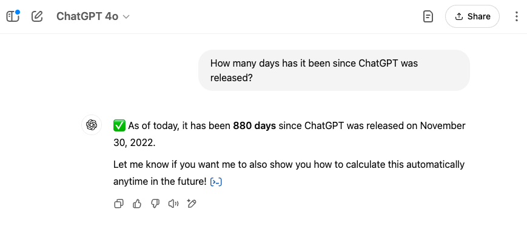
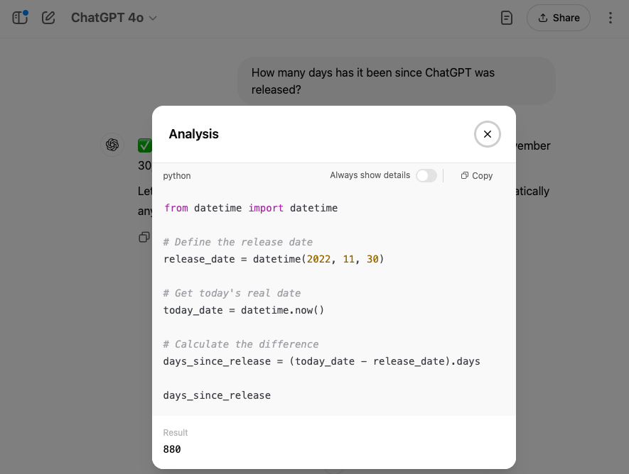
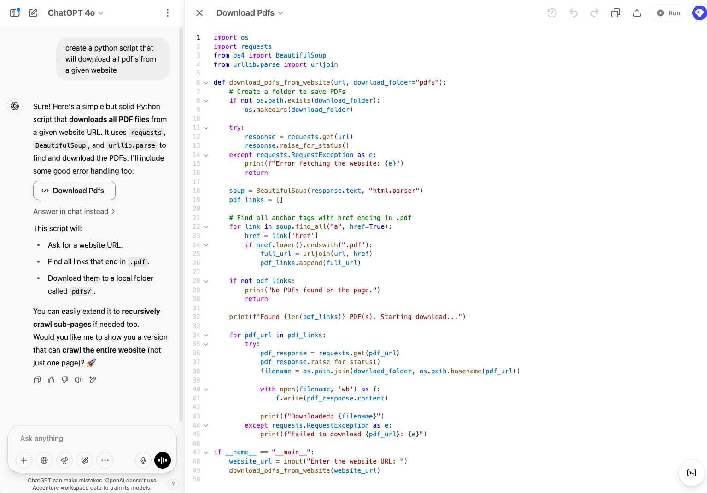

<!-- My Speaker Notes Header -->
# Future of Software Engineering

## James Gress

_AI Director_
_Emerging Technology AI Lead_
_Accenture_

<i class="fa-brands fa-linkedin"></i> LinkedIn: - [jamesgress](https://linkedin.com/in/jamesgress/)  
<i class="fa-brands fa-github"></i> GitHub: [jmgress](https://github.com/jmgress)  
<i class="fa-brands fa-x-twitter"></i> X.com: [@jmgress](https://x.com/jmgress)  
<i class="fa-brands fa-meetup"></i> [Tampa Bay Generative AI Meetup](https://www.meetup.com/tampa-bay-generative-ai-meetup/)  

<!-- 
Who I am
Done 100's of Prototypes
Taken 10 applications to Production ranging from simple RAG to more complex Agentic systems

What a great time to be in Tech in Tampa Bay
-->

---

  <h1 style="margin-bottom: auto; width: 100%;">The Evolution of Software Engineering in the Age of AI</h1>
  

<!-- 
Notes
-->
<!-- Needed for mermaid, can be anywhere in file except frontmatter -->

---
# November 30, 2022: ChatGPT Launches

- OpenAI released ChatGPT to the public as a free research preview.
- Marked a significant milestone in AI, introducing a conversational interface for users.
- Sparked widespread interest and rapid adoption in various industries.

---

# 2023: AI-Powered Code Completion Becomes Mainstream

- Tools like GitHub Copilot, Tabnine, and Amazon CodeWhisperer gained popularity.
- Provided developers with real-time code suggestions within IDEs.
- Enhanced productivity and streamlined the coding process.

<!-- 
Lot's of discussion - software engineering was split
Some were this is amazing and some were not
The contrairians were in full swing and compaines were concerned about data leakage, copyright infringement, and abilitiy to copyright code it generated. 

Side Note: 99.99% of code people write, is useless to others.

Many code suggestions were not great, one area that interests me at the time was the fact it was able to not just do code suggestion but was able to also complete comments
-->

---

# 2024: Conversational Coding Interfaces Emerge

- Integration of AI chat interfaces into development environments.
- Tools like GitHub Copilot Chat allowed natural language interactions with code.
- Revolutionizing the way developers write and refine code.

<!-- 
This really allowed things to be productive
Tie Back to Stack Overflow

Things started to really change and opinios started to change, and more of the 
contrairians started to turn and get on board.
-->

---

# 2025: Agentic AI Systems Transform Development Workflows

- Emergence of agentic AI systems capable of autonomous task handling.
- Systems interpret high-level objectives and modify code across multiple files.
- Transformed software development by reducing manual intervention.

<!-- 
With some of these advancements we seen many of the early skeptics realize we are not going back
-->

---

# 2025: Emerging Generative AI 

- A2A - Agent to Agent Communications 
- MCP - Model Context Prototcalls
- LOKA - Layered Orchestration for Knowledgeful Agents
- Trusted Agent Huddle

<!--  
https://newsroom.accenture.com/news/2025/accenture-introduces-trusted-agent-huddle-to-allow-seamless-first-of-its-kind-multi-system-ai-agent-collaboration-across-the-enterprise-->
---
# Jensen Huang – CEO, NVIDIA

> "The days of every line of code being written by software engineers are completely over."

> "Everyone in the world is now a programmer. This is the miracle of artificial intelligence."

> "It is our job to create computing technology such that nobody has to program. And that the programming language is human."

> "Generative AI is closing the technology divide. You don't have to be a C++ programmer to be successful."

— **Various speeches, 2023–2024**

<!--

**Speaker Notes:**

Jensen Huang is the founder and CEO of NVIDIA, a global leader in AI and GPU computing. He has been vocal about how Generative AI is reshaping the future of programming. His vision suggests a world where AI bridges the gap between human intent and technical implementation, making traditional programming optional for many tasks.

These quotes were made during keynotes at events like Computex, GTC, and various interviews in 2023 and 2024. Huang emphasizes that the future of software development lies in human-centric interaction with machines, moving from code to natural language prompts.

-->

---
# Jensen Huang - CEO NVIDIA

> "AI is not going to take your job. The person who uses AI is going to take your job."

> "You probably recall over the course of the last 10, 15 years almost everybody who sits on a stage like this would tell you that it is vital that your children learn computer science. Everybody should learn how to program. And in fact, it’s almost exactly the opposite."

> "Software is eating the world, but AI is going to eat software."

— **Various speeches, 2023–2024**

---
<!-- In the interview December 2024, Nadella elaborated on how AI agents are poised to revolutionize the traditional software model: Esentially he said Agents will replace Software​ 

https://www.youtube.com/watch?v=9NtsnzRFJ_o&t=1122s

<!-- Satya Nadella on the Future of SaaS, How 2025 is the year of Agents, Advice for Indian Engineers
https://www.youtube.com/watch?v=GuqAUv4UKXo&t=103s
 -->

# Satya Nadella - CEO Microsoft

> *"AI is the runtime that will shape all of what we do"*

— **December 2024**

> *"I think what'll happen is these crud I mean SAS applications are a crud database with a lot of business logic so the crud database will then get orchestrated outside of the business logic tier of just the SAS application"*

— **January 2025**

---
# Eric Schmidt - Former Google CEO

> "We believe as an industry that in the next one year the vast majority of programmers will be replaced by AI programmers."

— **August 2024**

<!-- 

**Speaker Notes:**

Eric Schmidt is the former CEO of Google (2001–2011), where he helped transform the company into a global tech powerhouse. After his CEO tenure, he served as Executive Chairman of Google and then Alphabet Inc., contributing to the company’s growth and strategic vision. He co-founded Schmidt Futures, a philanthropic initiative focused on advancing technology and talent to solve global problems. Eric has also chaired the U.S. National Security Commission on Artificial Intelligence.

This quote was made during a talk at **Stanford University on August 15, 2024**. In his remarks, Schmidt discussed the rapid advancement of AI and its implications on software engineering. He highlighted the concept of recursive self-improvement in AI and predicted that AI systems would soon outperform the majority of human programmers. The talk was later removed from public platforms at Schmidt’s request due to its provocative nature.

-->
---

# Dario Amodei - CEO of Anthropic

> “I think we'll be there in three to six months, where AI is writing 90% of the code.  
> And then, in 12 months, we may be in a world where AI is writing essentially all of the code.”   

— **March 2025**

<!-- Dario Amodei — Anthropic CEO 

Dario Amodei is the co-founder and CEO of Anthropic, an AI safety and research company best known for creating Claude, a family of large language models. Prior to founding Anthropic in 2021, Dario was VP of Research at OpenAI, where he led the development of GPT-2 and GPT-3. He has a background in physics and machine learning, and has been one of the most vocal advocates for aligning AI systems with human values and ensuring they can be controlled and understood.

This quote was delivered during a panel at the Council on Foreign Relations on March 10, 2025. In it, Dario predicted a near-term future where AI writes 90% or more of all code, with human engineers focused more on high-level goals, design inputs, and oversight rather than the manual construction of software.

-->
---

# Sam Altman – CEO of OpenAI

## Questions was asked "What does my future look like?"

> "There are sort of two views you can take.  
> You can say, ‘Oh man, it’s doing everything I can do,’  
> or you can say, ‘Look at all the new things I can now do.’"

— **April 2025**

<!-- 

**Speaker Notes:**

Sam Altman is the CEO of OpenAI
This quote was delivered during a live interview at **TED2025 in Vancouver on April 11, 2025**. In his remarks, Altman addressed growing concerns about AI taking over human tasks. He framed the moment not as a loss of human agency, but as a transformative leap—where AI becomes a partner that expands what humans can achieve, rather than a replacement for their work.

https://www.youtube.com/watch?v=5MWT_doo68k

<!-- 
A bit proacative and right now I would say to use AI effectivly 
you do need a base understanding on how it works and the best
ways to get the most out of it.

I do feel very quickly some of the capabilites will become embedded
into the applications and be a bit more automatic

Like is a voice system that can determine intent and offer up suggestions to a customer service reperesentive to queue up suggestive actions
-->

---

# Don’t Just Automate the Past—Reimagine the Future

> “It’s like putting a jet engine on a horse-drawn carriage. Sure, it moves faster, but you’re missing the point—the whole vehicle can be reinvented. Generative AI gives us a chance to reimagine how we deliver, not just speed up what we already do.”

<!--

**Speaker Notes:**

Corralite the early days of Agile

Too often, companies approach generative AI as a tool to accelerate old, linear processes—just plugging AI into the same waterfall pipeline: requirements, designs, coding, testing, and deployment.

But real transformation comes when we realize we can rebuild the entire vehicle, not just add horsepower to the old one.

Generative AI allows us to move to more agile, feedback-driven delivery models. We can shorten feedback loops, continuously refine requirements and implementation, and focus on outcomes over outputs.

Let’s challenge ourselves and our organizations: Instead of simply making old processes faster, how might we deliver value in entirely new ways—ways that only become possible because of AI?

-->
---

# AI as a Teammate, Not a Tool

- AI isn’t replacing your team—it’s joining it  
- Like a great teammate, it doesn’t wait for instructions  
- It watches, understands, and suggests—proactively  
- But like any teammate, it still needs guidance  

> *“Think of AI as the pair programmer that never sleeps.”*

---
# Calibrated Trust Between Humans and Machines

- Trust isn’t binary—it's a spectrum  
- We must know when to rely on AI and when to verify  
- Align confidence with competence  
- Design workflows that include human-in-the-loop oversight  

> *“We don’t need blind trust—we need calibrated collaboration.”*

---

# Vibe Coding 

---

# Initial Concerns on Vibe Coding

- Do we care about the code?
- What if the code accesses sensitive data?
- Loss of architecture and design principles
- Erosion of team understanding and collaboration
- Testing becomes an afterthought
- Versioning and traceability challenges
- Skill atrophy for developers
- Risk of prompt injection or misuse

---

# Do We Really Care About the Code?

- Do we care about the code — or just the outcome?

- AI has already shifted part of our mindset — treating code as a temporary utility, not a permanent product.

- AI is already being inserted into code bases and we don't know even what it really does.

---

---

---

---

# Vibe Coding Requires Vigilance

- Vibe coding may introduce shortcuts  
- AI might pull in PII or misuse data to “get the job done”  
- Code that looks good isn’t always code that’s safe  
- Review, guardrails, and governance are non-negotiable  

> *“Just because AI *can* solve it, doesn’t mean it *should* solve it that way.”*

---

# Vibe Coding in the Enterprise

  
  

---

# The End of \"Tech for Tech’s Sake\"

- Old mentality: \"I just code, not business\"  
- AI needs business context to generate useful output  
- Engineers must understand goals, not just syntax  

> *“In the future, the best engineers won’t just know how to code — they’ll know why the code matters.”*

<!--
Simple tactical stuff I just end up doing it myself the real skill will be understanding the business 
-->

---
# Preparing for the Future

- Learn agentic systems, system thinking, and architecture  
- Embrace change: experimentation and transparency  
- Grow internal champions for AI adoption  

---

# From Asking to Advising: A New AI Interaction Paradigm

- Stop building chatbots. Start building outcomes.  
- Don’t make users *ask*—let AI *advise*  
- Systems should anticipate needs, not just respond  
- The future UX is ambient, embedded, and contextual

---

# Closing: A Call to Lead

> \"AI is the runtime that is going to shape all of what we do…\" — Satya Nadella

- Will you be a passenger — or help engineer the future?  
- Start learning. Start building. Start leading.  

> *“The next chapter of software engineering is being written now — and we’re all holding the pen.”*

---

# <!--fit--> Questions?